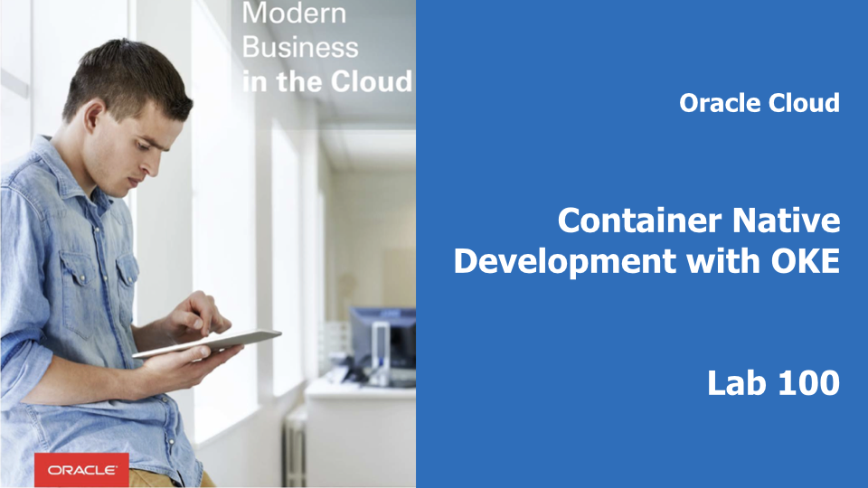
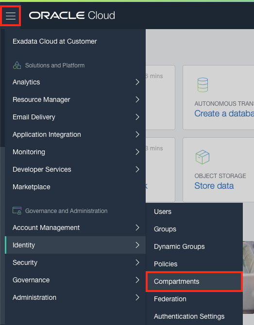

# Provision Kubernetes Using the OCI Console

## Introduction

This is the first of several labs that are part of the **Oracle Public Cloud Container Native Development workshop**. This workshop will walk you through the process of moving an existing application into a containerized CI/CD pipeline and deploying it to a Kubernetes cluster in the Oracle Public Cloud.

You will take on 2 personas during the workshop. The **Lead Developer Persona** will be responsible for configuring the parts of the automated build and deploy process that involve details about the application itself. The **DevOps Engineer Persona** will configure the cloud infrastructure, provision the Kubernetes cluster and Autonomous Database. To containerize and automate the building and deploying of this application you will make use of Wercker Pipelines for CI/CD, Docker Hub for a Docker container registry, and Oracle Container Engine for Kubernetes (OKE) to provision a Kubernetes cluster on Oracle Cloud Infrastructure.

During this lab, you will take on the **DevOps Engineer Persona**. You will provision a Kubernetes cluster and all of the infrastructure that it requires using the OCI console. OCI will provision the Virtual Cloud Network, Load Balancers, Kubernetes Master and Worker instances, and etcd instance required to support your cluster.

## Objectives

**Provision Oracle Container Engine for Kubernetes (OKE)**

- Create a Kubernetes Cluster
  - Set Up Oracle Cloud infrastructure
  - Provision Kubernetes Using the OCI Console
  - Create and upload API key for cluster management

## Required Artifacts

- The following lab requires an Oracle Public Cloud account. You may use your own cloud account, or a cloud account that you obtained through a trial.

# Provision Kubernetes Using the OCI Console

## Set Up Oracle Cloud Infrastructure

### **STEP 1**: Log in to your OCI dashboard

- If you are using a Trial Account, **you must wait until you receive this email** indicating that your Cloud Account has been provisioned. _Please note that this email may arrive in your spam or promotions folder pending your email settings._

  

- Once you receive the **Get Started with Oracle Cloud** Email, make note of your **Username, Password and Cloud Account Name**.

  

- From any browser go to:

    [https://cloud.oracle.com/en_US/sign-in](https://cloud.oracle.com/en_US/sign-in)

- Enter your **Cloud Account Name** in the input field and click the **My Services** button. If you have a trial account, this can be found in your welcome email. Otherwise, this will be supplied by your workshop instructor.

  

- Enter your **Username** and **Password** in the input fields and click **Sign In**. If you have a trial account, these can be found in your welcome email.

  

**NOTE**: If you have used your trial account already, you may have been prompted to change the temporary password listed in the welcome email. In that case, enter the new password in the password field.

- In the top left corner of the dashboard, click the **hamburger menu**

  

- Click to expand the **Services** submenu, then click **Compute**

  

- On the OCI Console sign in page, enter the same **Username** as you did on the previous sign in page. If you are using a trial account and this is your first time logging into the OCI Console, enter the **temporary password** from your trial account welcome email. If you have already visited the OCI Console and changed your password, enter your **new password**. Otherwise, this password will be supplied by your workshop instructor.

  

### **STEP 2**: Create a Compartment for your Kubernetes nodes

Compartments are used to isolate resources within your OCI tenant. Role-based access policies can be applied to manage access to compute instances and other resources within a Compartment.

- Click the **hamburger icon** in the upper left corner to open the navigation menu. Under the **Identity** section of the menu, click **Compartments**

  

  - If you have a **Demo** compartment already, _**SKIP THIS STEP**_. Otherwise, Click **Create Compartment**

    

  - In the **Name** field, enter `Demo`. Enter a description of your choice. In the **Parent Compartment** field, ensure that the `root` compartment is selected (it will have the same name as your Oracle Cloud Account). Click **Create Compartment**.

    

### **STEP 3**: Add a Policy Statement for OKE

  - Before the Oracle managed Kubernetes service can create compute instances in your OCI tenancy, we must explicitly give it permission to do so using a policy statement. From the OCI Console navigation menu, choose **Identity->Policies**.

    

  - In the Compartment drop down menu on the left side, choose the **root compartment**. It will have the same name as your OCI tenancy (Cloud Account Name).

    

  - Click **PSM-root-policy**

    

  - Click the **Add Policy Statement** button

    

  - In the Statement box, enter: `allow service OKE to manage all-resources in tenancy` and click **Add Statement**

    

### **STEP 4**: Provision Kubernetes Using the OCI Console

  - Now we're ready to create our Kubernetes cluster. From the OCI Console navigation menu, select **Developer Services->Container Clusters (OKE)**.

    

  - In the Compartments drop down, select the **Demo** compartment.

    

  - Click **Create Cluster**

    

  - We don't need to make any changes to the default values on this form, but let's look at what will be created when we submit it.

    
    

    - Starting at the top you'll notice that the cluster will be created in our **Demo** compartment.
    - We can customize the name of this cluster if we want
    - Multiple versions of Kubernetes are available, with the newest version selected by default
    - The default cluster creation mode will automatically create a Virtual Cloud Network for our cluster, including 2 load balancer subnets and 3 subnets for our worker VMs
    - We can customize the size and quantity of worker VMs in the node pool; by default we will get 3x 1 OCPU VMs, one in each Availability Domain.
    - Select **VM.Standard2.1** for the VM Shape from the **SHAPE** dropdown list if this is not the default.
    - We can also add more node pools to the cluster after creation.
    - The dashboard and Tiller will be installed by default.

  - Click **Create**. You will be brought to the cluster detail page. Your cluster will take a while to provision, so let's use this time to generate an API signing key pair to manage our cluster using the command line.

### **STEP 5**: Generate an API Signing Key Pair

  The following steps assumes you're using a Linux or MacOS system.

  Use OpenSSL commands to generate the key pair in the required PEM format.

  - If you haven't already, create a .oci directory to store the credentials:

    `mkdir ~/.oci`

  - Generate the private key with one of the following commands:

    `openssl genrsa -out ~/.oci/oci_api_key.pem -aes128 2048`

  - Ensure that only you can read the private key file:

    `chmod go-rwx ~/.oci/oci_api_key.pem`

  - Generate the public key:

    `openssl rsa -pubout -in ~/.oci/oci_api_key.pem -out ~/.oci/oci_api_key_public.pem`

  - Copy the contents of the public key to the clipboard using pbcopy, xclip or a similar tool (you'll need to paste the value into the Console later). For example:

    `cat ~/.oci/oci_api_key_public.pem | pbcopy`

  - Get the key's fingerprint with the following OpenSSL command:

    `openssl rsa -pubout -outform DER -in ~/.oci/oci_api_key.pem | openssl md5 -c`

    When you upload the public key in the Console, the fingerprint is also automatically displayed there. It looks something like this: `12:34:56:78:90:ab:cd:ef:12:34:56:78:90:ab:cd:ef`

### **STEP 6**: Upload the Public Key of the API Signing Key Pair

  You can now upload the PEM public key in the OCI Console.

  - In the Console, click **api.user**, and then click **User Settings**. The user details page is now shown.

  - Click **Add Public Key**

  - Paste the contents of the PEM public key in the dialog box and click **Add**

    You should see something similar to below with the key's fingerprint under the API Keys.

    

### **STEP 7**: Verify Your Clusters

You should verify your cluster has been created successfully before moving on to Lab 200.

  - Click on your cluster name

  - Verify all the computer nodes in your node pool is in the active state.

**You are now ready to move to the next lab: [Lab 200](LabGuide200.md)**
