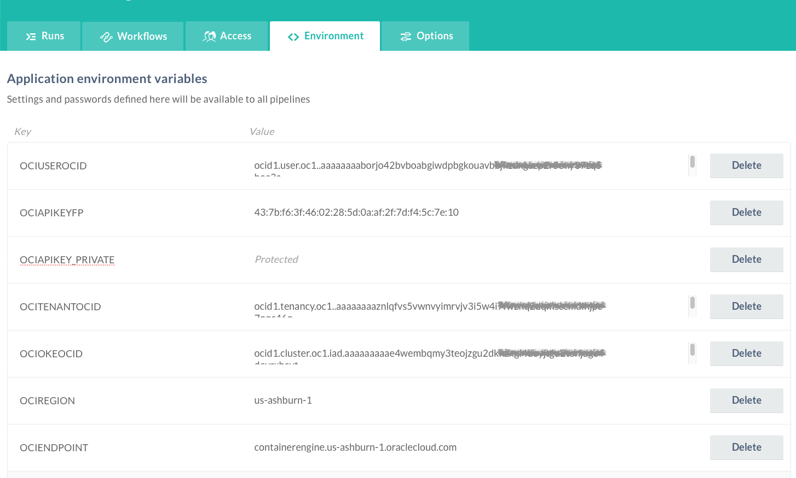
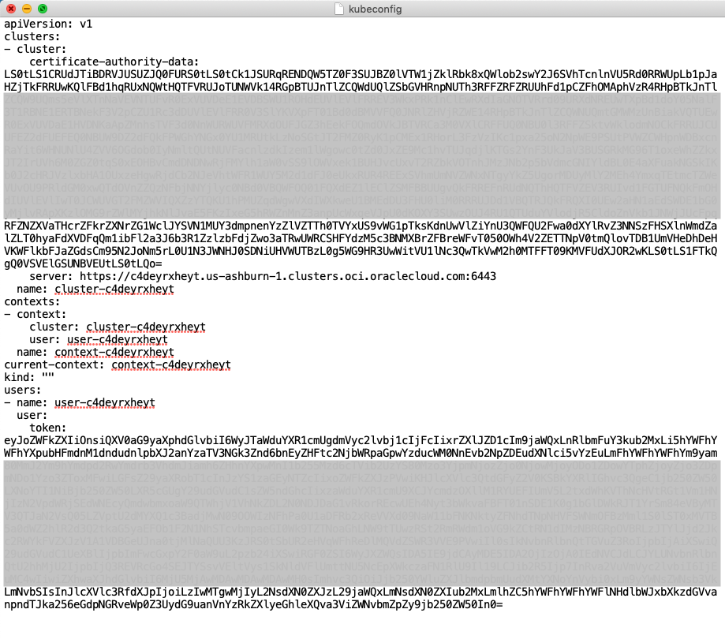

# Downloading a kubeconfig File to Enable Cluster Access


## Introduction

This is the second of several labs that are part of the **Oracle Public Cloud Container Native Development workshop**. This workshop will walk you through the process of moving an existing application into a containerized CI/CD pipeline and deploying it to a Kubernetes cluster in the Oracle Public Cloud.

You will take on 2 personas during the workshop. The **Lead Developer Persona** will be responsible for configuring the parts of the automated build and deploy process that involve details about the application itself. The **DevOps Engineer Persona** will configure the parts of the automation involving the Kubernetes infrastructure. To containerize and automate the building and deploying of this application you will make use of Wercker Pipelines for CI/CD, Docker Hub for a Docker container registry, and Oracle Container Engine for Kubernetes (OKE) to provision a Kubernetes cluster on Oracle Cloud Infrastructure.

When you create a cluster, Container Engine creates a Kubernetes configuration file for the cluster called `kubeconfig`. The `kubeconfig` file provides the necessary details to access the cluster using **kubectl** and the Kubernetes Dashboard.

You must download the `kubeconfig` file and set an environment variable to point to it. Having completed the steps, you can start using **kubectl** and the Kubernetes Dashboard to manage the cluster.

Due to the possible differences that may arise from the installation of OCI-CLI tool in Windows or Linux environments, we will provide a workaround for this lab. Instead of installing the OCI-CLI in your environment, you will run a script defined as a **Wercker** application with your OCI and OKE details passed as environment variables to automate the download of `kubeconfig` file.


## Objectives

**Configure Wercker and Automate the Execution of The oke-kubconfig  Download Tool**

- Create Wercker Application
  - Fork the **oke-kubeconfig** download tool from GitHub
  - Create a Wercker account
  - Create a Wercker application
- Create and Run Wercker Pipelines
  - Define Wercker Build Pipeline
  - Set Environment Variables in Wercker
  - Copy content of output to `kubeconfig` file

## Required Artifacts

For this lab you will need a Github account. Use the following link to set one up:

  - a [GitHub account](https://github.com/join)


## Create Wercker Application

The tool for downloading the `kubeconfig` file is available as a Github project. This contains the script and predefined pipelines for execution in Wercker. We will create a Wercker application to download the `kubeconfig` file. This will introduce you to Wercker and get you familiarise with it for the later labs.

### **STEP 1**: Fork oke-kubeconfig Application on GitHub

- From any browser, go to:

  [https://github.com/kwanwan/okeight](https://github.com/kwanwan/oke-kubeconfig)

- Click **Fork** in the upper right hand corner of the browser. **Sign in** if prompted.

  

  **NOTE:** If prompted, choose to fork the repository to your account (this may occur if your account is also a member of an organization on GitHub).

### **STEP 2**: Create a Wercker account

  **NOTE** If you already have a Wercker account, use your account to log into Wercker, and proceed to **STEP 3**. If you have not associated your existing Wercker account with your GitHub account, you can do so in the **Settings->Git Connections** menu, found in the user dropdown in the top right corner of Wercker.

- In a new browser tab, go to:
    [http://app.wercker.com/](http://app.wercker.com/)

- Click **Sign Up** in the upper right hand corner of the browser. Alternately, if you have already signed up for a Wercker account, click **log in** and then **log in with GitHub** and skip to **STEP 3**.

  

- Click **Sign Up Using GitHub**

  

- Click the green **Authorize Wercker** button

  

- Enter **a username and your email address** to complete your Wercker account creation

  

### **STEP 3**: Create a Wercker Application

- If this is your first Wercker application, click the blue **Create your first application** button. If you already have applications in your Wercker account, click the **plus button** in the upper right hand corner of the browser and select **Add application**:

  


- Leave the default selections of **your account** for the owner and **GitHub** for the SCM and click **Next**

  

- Click on the **oke-kubeconfig** repository that appears in the list of your GitHub repositories, then click **Next**

  

- Leave the default selection of checkout without an SSH key and click **Next**

  

- Click **Create**

  


## Create and Run Wercker Build Pipeline

### **STEP 4**: Configure Pipelines and Workflow in Wercker

- Navigate to the Wercker page for your newly-created application (you will already be on that page if you just completed **STEP 3**). Notice that you are viewing the **Runs** tab. This is where any executions of your workflow will be recorded.

  

- Click the **Workflows** tab. You will see that Wercker has created the beginning of a workflow for you already. This workflow is triggered by a Git commit and it will execute a pipeline called **build**.

  

- The **build** pipeline will be used to build a Docker image that contains a shell script `get-kubeconfig.sh`. This will be executed with a set of environment variables passed to it. You can find the `get-kubeconfig.sh` in the Github **oke-kubeconfig** repository.

- Now that we've got a workflow configured that will build and store a Docker image containing our `get-kubeconfig.sh`, we need to define what parameters are required to pass to it via Wercker environment variables.


### **STEP 5**: Set Environment Variables in Wercker

- In your Wercker browser tab, click the **Environment** tab.

  

- Create an environment variable by filling in the **Key** and **Value** boxes and clicking **Add**. _Be sure to click **Add**_ after each environment variable, or they will not be saved. Repeat this step for each variable listed below.

  ```
  Key:                  Value:
  OCIUSEROCID           your OCI user ID
  OCIAPIKEYFP           your API key fingerprint
  OCIAPIKEY_PRIVATE     your API private key created in Lab 100
  OCITENANTOCID         your OCI tenancy ID
  OCIOKEOCID            your OKE cluster ID
  OCIREGION             us-ashburn-1 or us-phoenix-1 for your tenancy
  OCIENDPOINT           containerengine.us-ashburn-1.oraclecloud.com  or  containerengine.us-phoenix-1.oraclecloud.com
  ```

- You should end up with something similar to below.

  

  **NOTES**:

  - You can collect the values for the above keys in the OCI Console.


- Switch back to your Runs tab by clicking on the **Runs** tab.

- Click on **trigger a build now** at the bottom of the page to execute the **build** pipeline

  

- Click on the green **build** pipeline to drill into the details of each step. Note that you can click on each step to see the console output produced by that step. In our case we are interested the **docker build** step.

- Wait for the **docker build** step to complete and if successful you should see the content of your `kubeconfig` printed towards the bottom of the output in between the lines `=======PLEASE COPY AN PASTE BELOW` and `=======PLEASE COPY AN PASTE ABOVE` as shown below.

  

- Our next step is to copy and paste the `kubeconfig` content into a blank `kubeconfig` file on your local machine. Save the `kubeconfig` file as a plain text file, not as a .docx, .rtf, .html, etc.

  

- It is recommended to create a working directory such as `container-workshop` under your home directory. e.g. `~/container-workshop` for Mac or Linux.

- In order to interact with your cluster and view the dashboard, you will need to install the Kubernetes command line interface, `kubectl`, which we will do that next.


### **STEP 6**: Install and Test kubectl on Your Local Machine

- The method you choose to install `kubectl` will depend on your operating system and any package managers that you may already use. The generic method of installation, downloading the binary file using `curl`, is given below (**run the appropriate command in a terminal or command prompt**). If you prefer to use a package manager such as apt-get, yum, homebrew, chocolatey, etc, please find the specific command in the [Kubernetes Documentation](https://kubernetes.io/docs/tasks/tools/install-kubectl/).


  **Windows**
    ```bash
    cd %USERPROFILE%\container-workshop
    curl -LO https://storage.googleapis.com/kubernetes-release/release/v1.11.2/bin/windows/amd64/kubectl.exe
    ```

  **Mac**
    ```bash
    cd ~/container-workshop
    curl -LO https://storage.googleapis.com/kubernetes-release/release/$(curl -s https://storage.googleapis.com/kubernetes-release/release/stable.txt)/bin/darwin/amd64/kubectl
    chmod +x ./kubectl
    ```

  **Linux**
    ```bash
    cd ~/container-workshop
    curl -LO https://storage.googleapis.com/kubernetes-release/release/$(curl -s https://storage.googleapis.com/kubernetes-release/release/stable.txt)/bin/linux/amd64/kubectl
    chmod +x ./kubectl
    ```

- In your terminal window or command prompt, run the following commands to verify that `kubectl` is able to communicate with your cluster. You should see `cluster-info` print out the URL of the Kubernetes Master node and `get nodes` print out the IP address and status of each of the worker nodes.

  **Windows**
    ```bash
    set KUBECONFIG=%USERPROFILE%\container-workshop\kubeconfig
    kubectl.exe cluster-info
    kubectl.exe get nodes
    ```

  **Mac/Linux**
    ```bash
    export KUBECONFIG=~/container-workshop/kubeconfig
    ./kubectl cluster-info
    ./kubectl get nodes
    ```

    

    

    **NOTE**: You should see in the `cluster-info` that the Kubernetes master has an `oraclecloud.com` URL. If it instead has a `localhost` URL, your `KUBECONFIG` environment variable may not be set correctly. Double check the environment variable against the path and filename of your `kubeconfig` file.

- Now that we have verified that `kubectl` is connected to our cluster, let's increase the default auto-logout time so that we don't have to keep re-authenticating during the workshop. Note that the default logout time of 15 minutes is set for security reasons. The `--token-ttl=43200"` argument in the following command is the only change that we are making to the dashboard.

  **NOTE**: The following commands are **optional**.

  **Windows**
  ```bash
  kubectl.exe patch deployment kubernetes-dashboard -n kube-system -p "{\"spec\": {\"template\": {\"spec\": {\"containers\": [{\"name\": \"kubernetes-dashboard\", \"args\": [\"--token-ttl=43200\", \"--auto-generate-certificates\"]}]}}}}"
  ```

  **Mac/Linux**
  ```bash
  ./kubectl patch deployment kubernetes-dashboard -n kube-system -p '{"spec": {"template": {"spec": {"containers": [{"name": "kubernetes-dashboard", "args": ["--token-ttl=43200", "--auto-generate-certificates"]}]}}}}'
  ```

  

- Now that we've increased the session timeout, we can use `kubectl` to start a proxy that will give us access to the Kubernetes Dashboard through a web browser at a localhost URL. Run the following command in the same terminal window:

  **Windows**
    ```bash
    kubectl.exe proxy
    ```

  **Mac/Linux**
    ```bash
    ./kubectl proxy
    ```

  

  **NOTE**: If you receive an error stating `bind: address already in use`, you may have another application running on port 8001. You can specify a different port for the proxy by passing the `--port=` parameter, for example `kubectl proxy --port=8002`. Note that you  will have to modify the URL for the dashboard in the next step to match this port.

- Leave the proxy server running and navigate to the [Kubernetes Dashboard by Right Clicking on this link](http://localhost:8001/api/v1/namespaces/kube-system/services/https:kubernetes-dashboard:/proxy/), and choosing **open in a new browser tab**.

- You are asked to authenticate to view the dashboard. Click **Choose kubeconfig file** and select your `kubeconfig` file from the folder `~/container-workshop/kubeconfig`. Click **Open**, then click **Sign In**.

  

- After authenticating, you are presented with the Kubernetes dashboard.

  

- Great! We've got Kubernetes installed and accessible -- now we're ready to get our microservice deployed to the cluster. The next step is to tell Wercker how and where we would like to deploy our application. In your **terminal window**, press **Control-C** to terminate `kubectl proxy`. We will need the terminal window to gather some cluster info in another step. We'll start the proxy again later.


**You are now ready to move to the next lab: [Lab 300](LabGuide300.md)**
