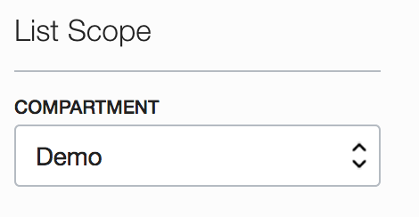
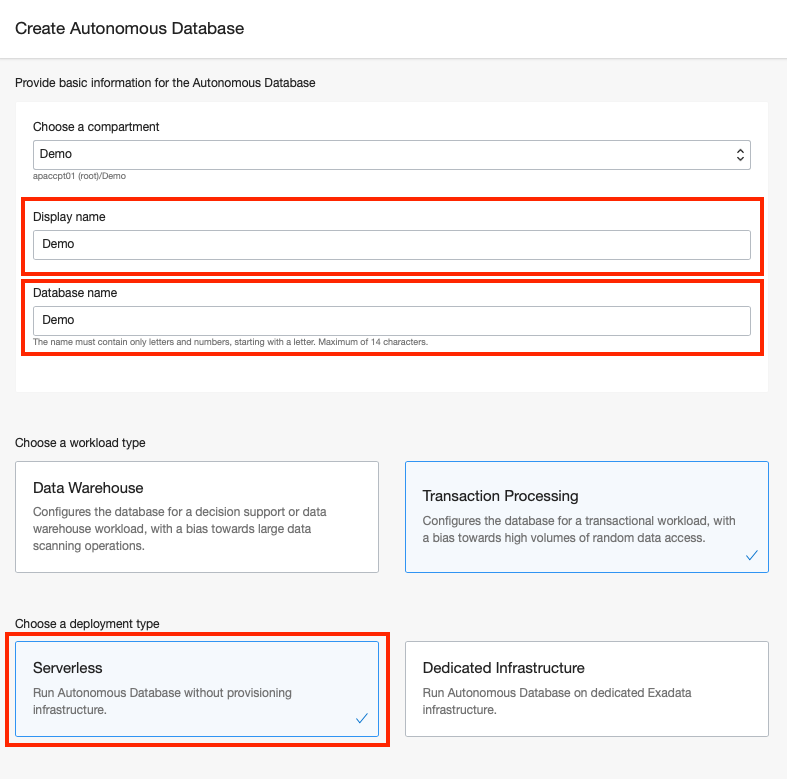

# Provision an Autonomous Transaction Processing Database

## Introduction

This is the second of several labs that are part of the **Oracle Public Cloud Container Native Development workshop**. This workshop will walk you through the process of moving an existing application into a containerized CI/CD pipeline and deploying it to a Kubernetes cluster in the Oracle Public Cloud.

You will take on 2 personas during the workshop. The **Lead Developer Persona** will be responsible for configuring the parts of the automated build and deploy process that involve details about the application itself. The **DevOps Engineer Persona** will configure the cloud infrastructure, provision the Kubernetes cluster and Autonomous Database. To containerize and automate the building and deploying of this application you will make use of Wercker Pipelines for CI/CD, Docker Hub for a Docker container registry, and Oracle Container Engine for Kubernetes (OKE) to provision a Kubernetes cluster on Oracle Cloud Infrastructure.

During this lab, you will take on the **DevOps Engineer Persona**. You will provision

## Objectives

**Provision and Configure an Autonomous Transaction Processing Database**

- Provision a new Autonomous Transaction Processing database

## Required Artifacts

- The following lab requires an Oracle Public Cloud account. You may use your own cloud account, or a cloud account that you obtained through a trial.

# Provisioning an Autonomous Transaction Processing Database Instance

In this section you will be provisioning an ATP database using the cloud console.

### **STEP 1: Create an ATP Instance**

Stay on the OCI Console.

- Click on the hamburger menu icon on the top left of the screen and then select **Autonomous Transaction Processing** from the list.

  

- Select **Demo** compartment, the one you created previously.

  

-  Click on **Create Autonomous Database** button to start the instance creation process

  

-  This will bring up Create ATP Database screen where you specify the configurations of the instance

  

#### Note: Oracle Cloud Infrastructure allows logical isolation of users within a tenant through Compartments. This allows multiple users and business units to share a tenant account while being isolated from each other.

If you have chosen the compartment you do not have privileges on, you will not be able to see or provision instance in it.

More information about Compartments and Policies is provided in the OCI Identity and Access Management documentation [here](https://docs.cloud.oracle.com/iaas/Content/Identity/Tasks/managingcompartments.htm?tocpath=Services%7CIAM%7C_____13).

-  Verify Demo compartment is selected

  

-  Specify a name for the instance and display name.

  

- For this lab we are not checking Dedicate Infrastructure

-  You can choose an instance shape, specified by the CPU count and storage size. Default CPU count is 1 and storage is 1 TB.

  

-  Specify the password for the instance

**NOTE**: Please take note of your password as you will require this in later labs.

- License Type: You will see 2 options under licensing options.

#### Bring my organization's Oracle Database software licenses to the Database service

#### or

#### Subscribe to new Oracle Datanase software licenses and the Database service.

- Leave it default to **Bring Your Own License (BYOL)**

  

- Make sure you have everything filled all required details

-  Click on **Create Autonomous Autonomous Database** to start provisioning the instance

  

- Once you create ATP Database it would take 2-3 minutes for the instance to be provisioned.

  

-  Once it finishes provisioning, you can click on the instance name to see details of it

  

You now have created your first Autonomous Transaction Processing database instance.

**You are now ready to move to the next lab: [Lab 300](LabGuide300.md)**
