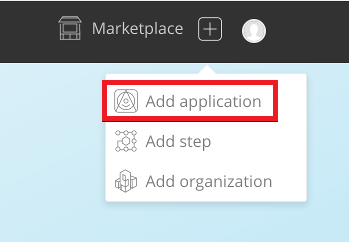
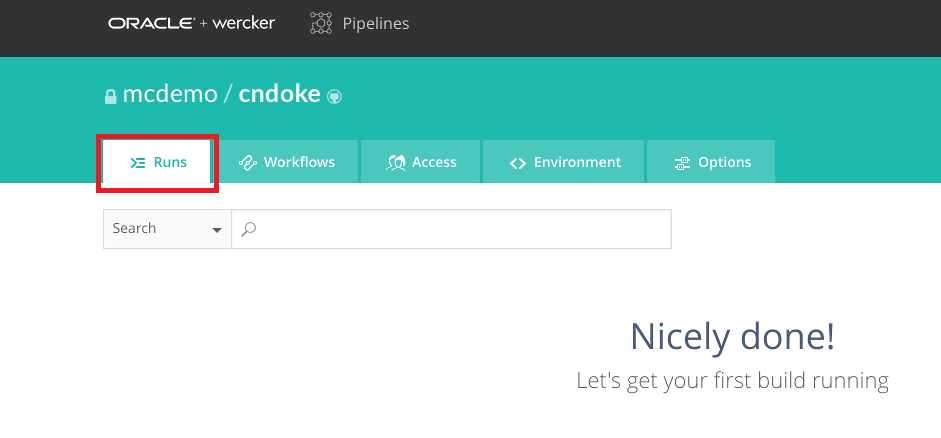
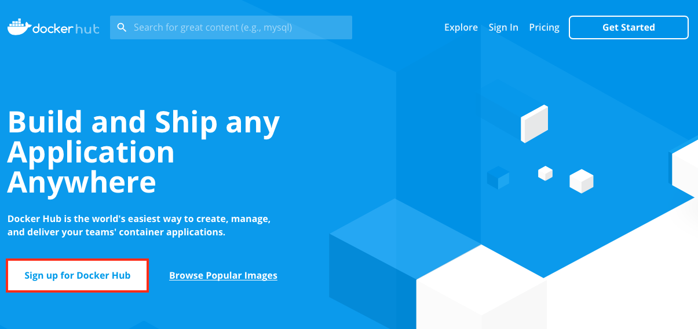
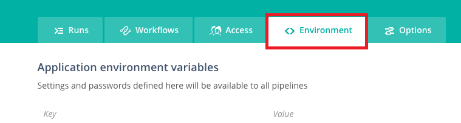
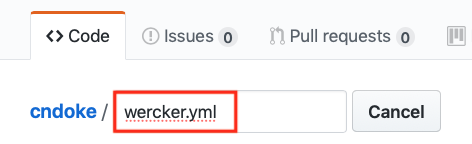
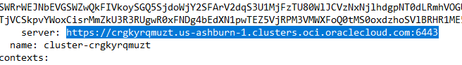
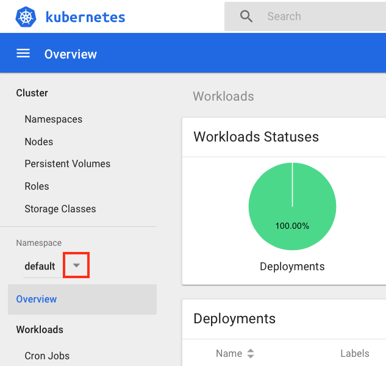

# Containerize Your Node.js Microservice


## Introduction

This is the forth of several labs that are part of the **Oracle Public Cloud Container Native Development workshop**. This workshop will walk you through the process of moving an existing application into a containerized CI/CD pipeline and deploying it to a Kubernetes cluster in the Oracle Public Cloud.

You will take on 2 personas during the workshop. The **Lead Developer Persona** will be responsible for configuring the parts of the automated build and deploy process that involve details about the application itself. The **DevOps Engineer Persona** will configure the parts of the automation involving the Kubernetes infrastructure. To containerize and automate the building and deploying of this application you will make use of Wercker Pipelines for CI/CD, Docker Hub for a Docker container registry, and Oracle Container Engine for Kubernetes (OKE) to provision a Kubernetes cluster on Oracle Cloud Infrastructure.

During this lab, you will take on the **Lead Developer Persona** and work on containerizing your Node.js application. You will set up Wercker to monitor your application's source code repository for commits and automatically trigger a build, and package pipeline, which will result in a Docker image of your application that is ready to be deployed.


## Objectives

**Containerize Your Node.js Application and Automate Building and Packaging**

- Create Wercker Application
  - Fork Node.js Application on GitHub
  - Create Wercker application
- Create and Run Wercker Pipelines
  - Configure Pipelines and Workflow in Wercker
  - Define Wercker Build Pipeline
  - Set Environment Variables in Wercker
  - Create Docker Hub Repository
  - Define Wercker Deoploy Pipeline
  - Validate Pipelines Execution

## Required Artifacts

For this lab you will need a Github and Docker Hub accounts. You should have GitHub set up already from the previous lab. Use the following link to set up a Docker Hub account:

- [Docker Hub account](https://hub.docker.com)


# Containerize Your Node.js Application and Automate Builds

## Create Wercker Application

### **STEP 1**: Fork Node.js Application on GitHub

- From any browser, go to:

    [https://github.com/mcosbdemo/cndoke](https://github.com/mcosbdemo/cndoke)

- Click **Fork** in the upper right hand corner of the browser. **Sign in** if prompted.

  

  **NOTE:** If prompted, choose to fork the repository to your account (this may occur if your account is also a member of an organization on GitHub).


### **STEP 2**: Create a Wercker Application

- Go back to your Wercker console. You should still be logged in.

- Click the **plus button** in the upper right hand corner of the browser and select **Add application**:

  


- Leave the default selections of **your account** for the owner and **GitHub** for the SCM and click **Next**

  

- Click on the **cndoke** repository that appears in the list of your GitHub repositories, then click **Next**

  

- Leave the default selection of checkout without an SSH key and click **Next**

  

- Click **Create**

  

- Do not generate a wercker.yml file -- we will create one in a later step.


## Create and Run Wercker Pipelines

### **STEP 3**: Configure Pipelines and Workflow in Wercker

- Navigate to the Wercker page for your newly-created application (you will already be on that page if you just completed **STEP 2**). Notice that you are viewing the **Runs** tab. This is where any executions of your workflow will be recorded.

  

- Click the **Workflows** tab. You will see that Wercker has created the beginning of a workflow for you already. This workflow is triggered by a Git commit and it will execute a pipeline called **build**.

  

- The **build** pipeline will be used to build your application and to store the resulting Docker image to Docker Hub repository. Click the **Add new pipeline** button.

  

- Fill in `deploy` for the name of the pipeline and the YML name of the pipeline and click **Create**.

  

- You will be presented with the pipeline's environment variable screen. We do not need to add any pipeline-specific environment variables, so just click on the **Workflows** tab to return to the workflow editor.

  

- Click the **plus sign** next to the **build** pipeline in the editor.

  

- In the **Execute Pipeline** drop down list, choose the pipeline we just created, **deploy**. Leave the other fields at their default values and click **Add**.

  

- Now that we've got a workflow configured, it will build and store a Docker image containing our application.

  

- However, we need to define exactly how to build and deploy in a file called **wercker.yml**, which we will store in our application's Git repository. We will define our **wercker.yml** in **STEP 7**.

- Before defining the **wercker.yml** we will need to create a Docker Hub registry for our built Docker image to store and specify the Docker Hub registry details as environment variable in Wercker to be passed to our **build** pipeline.


### **STEP 4**: Create a Docker Hub Account

- If you don't have a Docker Hub account, then create one first, otherwise you can go to the next step.

- In a browser, go to [Docker Hub](https://hub.docker.com)

- Click **Sign Up fo Docker Hub**

  

- Complete your Docker Identification

  


### **STEP 5**: Create a Docker Hub a Repository


- In a browser, go to Docker Hub and sign in.

- Click on **Create** Repository.

  

- In the **Name** field, enter `cndoke`. Optionally add descriptions and click **Create**.

  
  

- Your repository is now ready for Wercker to push a Docker image into during the **build** pipeline. Let's configure the environment variables to pass these Docker detail to the **build** pipeline.


### **STEP 6**: Set Wercker Environment Variables for the build Pipeline

- In your Wercker browser tab, click the **Environment** tab.

  

- Create an environment variable by filling in the **Key** and **Value** boxes and clicking **Add**. _Be sure to click **Add**_ after each environment variable, or they will not be saved. Repeat this step for each variable listed below.

  ```
  Key:                Value:
  DOCKER_USERNAME     your Docker Hub username
  DOCKER_PASSWORD     your Docker Hub password
  DOCKER_REPO         <your-dockerhub-username>/cndoke
  DOCKER_REGISTRY     https://registry.hub.docker.com/v2
  OCIUSEROCID         your OCI user ID
  OCITENANTOCID       your OCI tenancy ID
  OCIAPIKEY_PRIVATE   your API private key created in Lab 100
  OCIAPIKEYFP         your API key fingerprint
  ```

  

  **NOTE**:

  - Replace `<your-dockerhub-username>` in the variable values with your username for your Docker Hub account.

  - Enter your Docker Hub password into the value field and click the **Protected** check box next to the field to hide your password.

  - The `DOCKER_REPO` must be all lowercase. Enter a repo name of your new repo. e.g. `cndoke`

  - The `DOCKER_REGISTRY` value above assumes you are using Docker Hub.


- This is all of the environment variables that we need to configure at this point. For now, let's finish setting up the **build** pipeline in Wercker so that we can try the build.


### **STEP 7**: Define Wercker Build Pipeline

- Switch back to your GitHub browser tab, showing your forked copy of the **cndoke** repository, and click **Create new file**

  

- In the **Name your file...** input field, type `wercker.yml`

  

- In the **Edit new file** input box, **paste** the following:

    ```yaml
    box:
      id: alpine:3.2

    build:
      box: oraclelinux:7-slim
      steps:
        - script:
            name: create keyfile
            code: |
              echo $OCIAPIKEY_PRIVATE > temp.pem
        - internal/docker-build:
            build-args: "OCIUSEROCID=$OCIUSEROCID OCIAPIKEYFP=$OCIAPIKEYFP OKEY=$OCIAPIKEY_PRIVATE OCITENANTOCID=$OCITENANTOCID OCIOKEOCID=$OCIOKEOCID OCIENDPOINT=$OCIENDPOINT OCIREGION=$OCIREGION DB_ADMIN_USER=$DB_ADMIN_USER DBPASSWORD=$DBPASSWORD DB_DESCRIPTOR=$DB_DESCRIPTOR ATPOCID=$ATPOCID"
            dockerfile: Dockerfile
            image-name: cndoke
        - internal/docker-push:
            image-name: cndoke
            username: $DOCKER_USERNAME
            password: $DOCKER_PASSWORD
            repository: $DOCKER_REPO
            registry: $DOCKER_REGISTRY
            tag: latest, $WERCKER_GIT_BRANCH-$WERCKER_GIT_COMMIT
            ports: 80
            env: LD_LIBRARY_PATH=/opt/oracle/instantclient_19_3 TNS_ADMIN=/reward/wallet WALLET_LOCATION=/reward/wallet
            cmd: node server.js
    ```

- You should have **24 lines** of YAML in the editor:

  

- Let's look at the two sections of YAML that we've just added.

  - The first section describes a **box**. A **box** is the image that you want Wercker to pull from a Docker registry (the default is Docker Hub) to build your pipeline from. In our case, we need a Alpine environment to run our application, so we will pull the **alpine** image from Docker Hub.

  - The second section defines our first pipeline, the **build** pipeline. Our **build** pipeline consists of three **steps**,

    - First step to execute a shell command to write the OCI API private key from a Wercker environment variable into a PERM file (**script**) and
    - Second step is to invoke the build (**internal/docker-build**) step.
    - Third step of our pipeline, the **internal/docker-push** step, will store our container image in a Docker Hub repository after a successful build.

      The **internal/docker-push** is a command developed by Wercker, which will take the current pipeline image and push it to a Docker registry. You can, however, use a different repository -- the step supports a `repository` parameter. You can find more info in the [documentation](http://devcenter.wercker.com/docs/steps/internal-steps#docker-push).

      We have made use of several environment variables. We are tagging the release with the Git branch name and the Git commit hash so that we can trace our running application version back to a specific Git commit. These two variables (along with [others](http://devcenter.wercker.com/docs/environment-variables/available-env-vars#hs_cos_wrapper_name)) are automatically made available by Wercker. The `$DOCKER_USERNAME`, `$DOCKER_REGISTRY`, and `$DOCKER_REPO` environment variables, on the other hand, reference the ones that we defined ourselves in the previous step.


- At the bottom of the page, click the **Commit new file** button.

  

- Switch back to your **Wercker** browser tab and click on the **Runs** tab. If you are quick enough, you will see that Wercker has been notified of your new Git commit (via a webhook) and is executing your workflow.

  

- You should see that the **build** pipeline completes successfully, but the **deploy** pipeline fails. That's what we expected, since we have not yet defined the steps for the **deploy** pipeline in our **wercker.yml** file.

  

- Click on the green **build** pipeline to drill into the details of each step. Note that you can click on each step to see the console output produced by that step. In our case that output includes things like the results of the build before packaging our application. If any commands produce an error status code, Wercker will abort the workflow and notify you via email.

  

- Our next step is to define the second part of our workflow, the **deploy** pipeline, which will pull from our container image in a Docker Hub repository after a successful build.


### **STEP 8**: Set Wercker Environment Variables for the deploy Pipeline

- As we learned earlier, we do not yet have enough information to enable Wercker to deploy the Docker image to our OKE cluster -- we still need the Kubernetes authentication token and store it in a Wercker environment variable as well as the Kubernetes master node for the deployment.


- In your Wercker browser tab, click the **Environment** tab.

  

- Create an environment variable at the end of the list by filling in the **Key** and **Value** boxes and clicking **Add**. _Be sure to click **Add**_ after each environment variable, or they will not be saved. Repeat this step for each variable listed below.

  ```
  Key:                Value:
  KUBERNETES_MASTER   Your Kubernetes master node
  KUBERNETES_TOKEN    Your Kubernetes authentication token
  NS                  Your Kubernetes namespace. (e.g. cndoke)
  DB_ADMIN_USER       Your ATP admin username
  DBPASSWORD          Your ATP admin password
  DB_DESCRIPTOR       <dbname_tp> + _tp (e.g. cndokeDB_tp)
  ```

  


- Our first step is to set our cluster's authentication token as a Wercker environment variable. In your **terminal window**, run the following commands to output the token, then **select it and copy it** to your clipboard:

  **Windows**
    ```bash
    cd %USERPROFILE%\container-workshop
    notepad kubeconfig
    ```

    - Find the `token:` section at the bottom of the file, and copy the token value from there.

    

  **Mac/Linux**
    ```bash
    cd ~/container-workshop
    cat kubeconfig | grep token | awk '{print $2}'
    ```

    


- Back in your Wercker browser tab, click the **Environment** tab. In the key field of the empty row below the last environment variable, enter the key **KUBERNETES_AUTH_TOKEN**. In the value field, **paste** the token we just copied. Check the **Protected** box and click **Add**.

    

- The next environment variable we need to add is the address of the Kubernetes master we want to deploy to. You can find this the **kubeconfig** file.

  **Windows/Mac/Linux**

  - Locate the line with `server`, then **Copy and Paste** the `server` string from your **kubeconfig** file:

    


- Alternative, for Mac and Linux users, we can get the `server` URL from `kubectl`. Run the following command in your **terminal window** to output the URL, then **select it and copy it** to your clipboard:

  **Mac/Linux**

  - For Mac/Linux:

    ```bash
    echo $(./kubectl config view | grep server | cut -f 2- -d ":" | tr -d " ")
    ```

  - In your Wercker browser tab, add a new environment variable with the key **KUBERNETES_MASTER**. In the value field, **paste** the value you copied from `kubectl`. The value **must start with https://** for Wercker to communicate with the cluster. When finished, click **Add**.

    

    **NOTE**: You can also find this address in the OCI Console OKE page, by clicking on your cluster name to view the detail page:

      

- The third environment variable we need to add is the namespace of the Kubernetes. You can find this the **kubeconfig** file. Namespace is a way to divide cluster resources between multiple users. It is good practice to deploy your application into your own namespace.

  - In your Wercker browser tab, add a new environment variable with the key **NS**. In the value field, enter `cndoke` as the value or a value of your choice such as your name. When finished, click **Add**.

- And finally to connect to our ATP database we will need to pass the database username, password and the database descriptor.

  - The `DB_DESCRIPTOR` must be made up of your `<dbname>` + `_tp` suffix. e.g. `cndokeDB_tp`


### **STEP 9**: Define Wercker Deployment Pipeline

- Switch back to your GitHub browser tab.

- Click the file **wercker.yml** and then click the **pencil** button to begin editing the file.

    

- **Copy** the YAML below and **paste** it below the **build** pipeline we defined earlier.

  ```yaml
  deploy:
  box:
    id: alpine
    cmd: /bin/sh
  steps:
    - bash-template

    - kubectl:
        name: apply namespace
        server: $KUBERNETES_MASTER
        token: $KUBERNETES_TOKEN
        insecure-skip-tls-verify: true
        command: apply -f ./ns.yml
    - kubectl:
        name: delete OCR secret
        server: $KUBERNETES_MASTER
        token: $KUBERNETES_TOKEN
        insecure-skip-tls-verify: true
        command: delete secret wrelease --namespace=$NS --ignore-not-found=true
    - kubectl:
        name: create OCR secret
        server: $KUBERNETES_MASTER
        token: $KUBERNETES_TOKEN
        insecure-skip-tls-verify: true
        command: create secret docker-registry wrelease --docker-server=$DOCKER_REGISTRY --docker-username=$DOCKER_USERNAME --docker-password="$DOCKER_PASSWORD" --docker-email=${WERCKER_APPLICATION_OWNER_NAME}@mail.com --namespace=$NS
    - kubectl:
        name: apply deplyoment
        server: $KUBERNETES_MASTER
        token: $KUBERNETES_TOKEN
        insecure-skip-tls-verify: true
        command: apply -f ./cndoke-deploy.yml --namespace=$NS
    - kubectl:
        name: apply service
        server: $KUBERNETES_MASTER
        token: $KUBERNETES_TOKEN
        insecure-skip-tls-verify: true
        command: apply -f ./cndoke-service.yml --namespace=$NS
  ```


  >This will define a new Pipeline called **deploy**. The pipeline will make use of a new type of step: **kubectl**. If you have used Kubernetes before, you will be familiar with kubectl, the standard command line interface for managing Kubernetes. The kubectl Wercker step can be used to execute Kubernetes commands from within a Pipeline.

  >The **deploy** Pipeline will prepare our kubernetes.yml file by filling in some environment variables. It will then use **kubectl** to tell Kubernetes to apply that configuration to our cluster.

- You should see line 26 to 62 in your **werkcer.yml**

  

- At the bottom of the page, click **Commit changes**

  

- Since you've committed to the repository again, Wercker will once again trigger an execution of your workflow. So we'll end up with a new Run and a new image, and a deployment to Kubernetes.

- The **deploy** pipeline should be executed and completed without failure.

  


  ### **STEP 10**: Validate Deployment

  - First we need to validate your deployment to the Kubernetes cluster has been successful.

  - In a terminal window, start the **kubectl proxy** using the following command. Your `KUBECONFIG` environment variable should still be set from a previous step. If not, reset it.

    **Windows**
  ```bash
  kubectl.exe proxy
  ```

     **Mac/Linux**
  ```bash
  ./kubectl proxy
  ```

  - In a browser tab, navigate to the [**Kubernetes dashboard**](http://localhost:8001/api/v1/namespaces/kube-system/services/https:kubernetes-dashboard:/proxy/)

- You should see the overview page. In the left side navigation menu, click the down arrow icon next to the `default` namespace to open the dropdown menu list.

  

- Change the namespace to `cndoke`.

  


- In the **Deployments** section, you should see the `cndoke` deployment has ran successfully. And a `cndoke` pod running under the **Pods** section. The IP address for the pod is an internal IP address and is not accessible externally.

  

- To access the application, we need to use a cluster-external IP. Our application will be exposed to the internet via a load balancer. The load balancer will take a few minutes to be instantiated and configured. Let's check on its status. Click **Services** from the left side navigation menu.

  

- On the service page, you will see a column called **External endpoints**. Once the load balancer has finished provisioning, the External endpoints column will be populated with a link to the CafeSupremo application. If the link is not shown yet, wait a few minutes, refresh your browser, and check again. Once the link is displayed, click it to launch the site in a new tab.

- You should see the CafeSupremo site load successfully, validating that our new Kubernetes deployment and service were created correctly. Let's test the CafeSupremo functionality of the catalog. However, you may have noticed that the page may not have been rendered correctly as the graphics are oversized.

- Since the application is designed for a mobile phone screen, you will need to resize your browser so that the application home page would render in the correct format. You can resize your browser or switch to a mobile phone format under your browser's _Developer Tools_.

  

- After you've resized your browser, click on the hamburger icon on the top left hand corner to expose the navigation menu.

  

- Explore by clicking on **Discover** and **Stores** options. These should show you the types of coffees available in store and the store locations. However, the **Rewards** and **Logout** options are greyed out as these options are available after a successful user login.

- Click on **Welcome** to go back to the home page.

- Click **Sign In** to login.

  

- A login dialog box will pop up with the _Username_ pre-filled. Enter `Oracle123` in the password field and click **Submit**.

- You would not be able to login and should see the following error message.

  

- This is expected as our login feature has not been enabled yet. Also the database has not been populated with customer data.

- We have now verified the correct deployment of our application. But we need to create the customer schema and populate it with data in the next lab. We will also try out our automated CI/CD pipeline by enabling the login function in the next lab.


**You are now ready to move to the next lab: [Lab 500](LabGuide500.md)**
