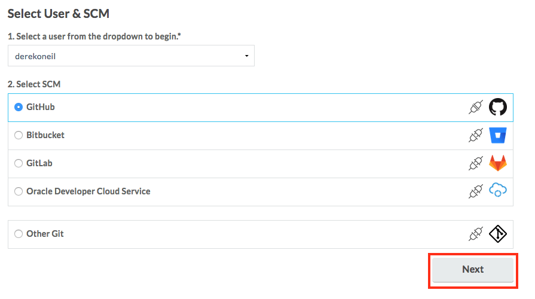
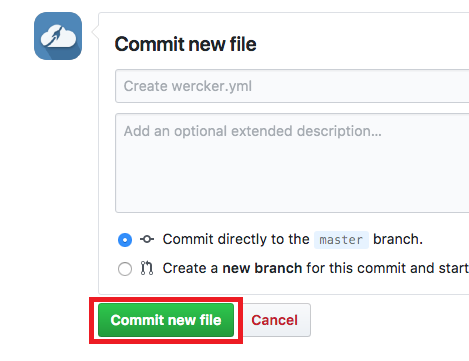
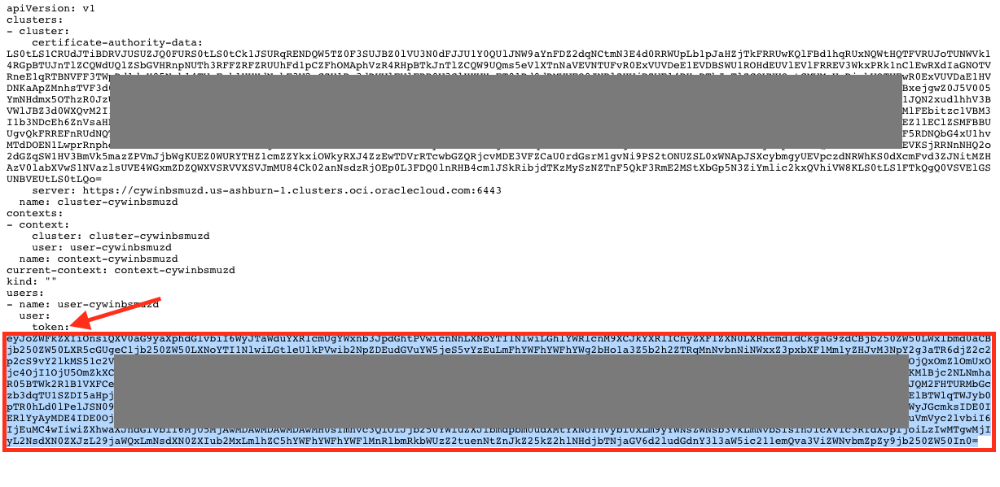

# Containerize Your Node.js Microservice


## Introduction

This is the second of several labs that are part of the **Oracle Public Cloud Container Native Development workshop**. This workshop will walk you through the process of moving an existing application into a containerized CI/CD pipeline and deploying it to a Kubernetes cluster in the Oracle Public Cloud.

You will take on 2 personas during the workshop. The **Lead Developer Persona** will be responsible for configuring the parts of the automated build and deploy process that involve details about the application itself. The **DevOps Engineer Persona** will configure the parts of the automation involving the Kubernetes infrastructure. To containerize and automate the building and deploying of this application you will make use of Wercker Pipelines for CI/CD, Docker Hub for a Docker container registry, and Oracle Container Engine for Kubernetes (OKE) to provision a Kubernetes cluster on Oracle Cloud Infrastructure.

During this lab, you will take on the **Lead Developer Persona** and work on containerizing your existing Java application. You will set up Wercker to monitor your application's source code repository for commits and automatically trigger a build, and package pipeline, which will result in a Docker image of your application that is ready to be deployed.


## Objectives

**Containerize Your Node.js Application and Automate Building and Packaging**

- Create Wercker Application
  - Fork Node.js Application on GitHub
  - Create a Wercker account
  - Create Wercker application
- Create and Run Wercker Pipelines
  - Configure Pipelines and Workflow in Wercker
  - Define Wercker Build Pipeline
  - Set Environment Variables in Wercker
  - Define Wercker Publish Pipeline
  - Validate Workflow Execution

## Required Artifacts

For this lab you will need a Github account. Use the following link to set one up:

  - a [GitHub account](https://github.com/join)

# Containerize Your Node.js Application and Automate Builds

## Create Wercker Application

### **STEP 1**: Fork Node.js Application on GitHub

- From any browser, go to:

    [https://github.com/mcosbdemo/cndoke](https://github.com/mcosbdemo/cndoke)

- Click **Fork** in the upper right hand corner of the browser. **Sign in** if prompted.

  

  **NOTE:** If prompted, choose to fork the repository to your account (this may occur if your account is also a member of an organization on GitHub).

### **STEP 2**: Create a Wercker account

  **NOTE** If you already have a Wercker account, use your account to log into Wercker, and proceed to **STEP 3**. If you have not associated your existing Wercker account with your GitHub account, you can do so in the **Settings->Git Connections** menu, found in the user dropdown in the top right corner of Wercker.

- In a new browser tab, go to:
    [http://app.wercker.com/](http://app.wercker.com/)

- Click **Sign Up** in the upper right hand corner of the browser. Alternately, if you have already signed up for a Wercker account, click **log in** and then **log in with GitHub** and skip to **STEP 3**.

  

- Click **Sign Up Using GitHub**

  

- Click the green **Authorize Wercker** button

  

- Enter **a username and your email address** to complete your Wercker account creation

  

### **STEP 3**: Create a Wercker Application

- If this is your first Wercker application, click the blue **Create your first application** button. If you already have applications in your Wercker account, click the **plus button** in the upper right hand corner of the browser and select **Add application**:

  


- Leave the default selections of **your account** for the owner and **GitHub** for the SCM and click **Next**

  

- Click on the **cndoke** repository that appears in the list of your GitHub repositories, then click **Next**

  

- Leave the default selection of checkout without an SSH key and click **Next**

  

- Click **Create**

  

- Do not generate a wercker.yml file -- we will create one in a later step.

## Create and Run Wercker Build Pipeline

### **STEP 4**: Configure Pipelines and Workflow in Wercker

- Navigate to the Wercker page for your newly-created application (you will already be on that page if you just completed **STEP 3**). Notice that you are viewing the **Runs** tab. This is where any executions of your workflow will be recorded.

  

- Click the **Workflows** tab. You will see that Wercker has created the beginning of a workflow for you already. This workflow is triggered by a Git commit and it will execute a pipeline called **build**.

  

- The **build** pipeline will be used to build and unit test our application. Let's create a new pipeline to store the resulting Docker image in a Docker Hub repository. Click the **Add new pipeline** button.

  

- Fill in `deploy` for the name of the pipeline and the YML name of the pipeline and click **Create**.

  

- You will be presented with the pipeline's environment variable screen. We do not need to add any pipeline-specific environment variables, so just click on the **Workflows** tab to return to the workflow editor.

  

- Click the **plus sign** next to the build pipeline in the editor.

  

- In the **Execute Pipeline** drop down list, choose the pipeline we just created, **push-release**. Leave the other fields at their default values and click **Add**.

  

- Now that we've got a workflow configured that will build and store a Docker image containing our application, we need to define exactly how to do that in a file called **wercker.yml**, which we will store in our application's Git repository.


### **STEP 5**: Set Environment Variables in Wercker

- In your Wercker browser tab, click the **Environment** tab.

  

- Create an environment variable by filling in the **Key** and **Value** boxes and clicking **Add**. _Be sure to click **Add**_ after each environment variable, or they will not be saved. Repeat this step for each variable listed below.

  ```
  Key:              Value:
  DOCKER_USERNAME   <your-dockerhub-username>
  DOCKER_REGISTRY   https://registry.hub.docker.com/v2
  DOCKER_REPO       <your-dockerhub-username>/cndoke
  ```

  

  **NOTES**:

  - Replace `<your-dockerhub-username>` in the variable values with your username for your Docker Hub account.

  - The `DOCKER_REGISTRY` value above assumes you are using Docker Hub.

- This is all of the environment variables that we can fill in at this point. For now, let's finish setting up the `build` pipeline in Wercker so that we can try the build.


### **STEP 6**: Define Wercker Build Pipeline

- Switch back to your GitHub browser tab, showing your forked copy of the **cndoke** repository, and click **Create new file**

  

- In the **Name your file...** input field, type `wercker.yml`

  

- In the **Edit new file** input box, **paste** the following:

    ```yaml
    box:
      id: alpine:3.2

    build:
      box: oraclelinux:7-slim
      steps:
        - script:
            name: create keyfile
            code: |
              echo $OCIAPIKEY_PRIVATE > temp.pem
        - internal/docker-build:
            build-args: "OCIUSEROCID=$OCIUSEROCID OCIAPIKEYFP=$OCIAPIKEYFP OKEY=$OCIAPIKEY_PRIVATE OCITENANTOCID=$OCITENANTOCID OCIOKEOCID=$OCIOKEOCID OCIENDPOINT=$OCIENDPOINT OCIREGION=$OCIREGION DB_ADMIN_USER=$DB_ADMIN_USER DBPASSWORD=$DBPASSWORD DB_DESCRIPTOR=$DB_DESCRIPTOR ATPOCID=$ATPOCID"
            dockerfile: Dockerfile
            image-name: cndoke
        - internal/docker-push:
            image-name: cndoke
            username: $DOCKER_USERNAME
            password: $DOCKER_PASSWORD
            repository: $DOCKER_REPO
            registry: $DOCKER_REGISTRY
            tag: latest, $WERCKER_GIT_BRANCH-$WERCKER_GIT_COMMIT
            ports: 80
            env: LD_LIBRARY_PATH=/opt/oracle/instantclient_19_3 TNS_ADMIN=/reward/wallet WALLET_LOCATION=/reward/wallet
            cmd: node server.js
    ```

- You should have **24 lines** of YAML in the editor:

  

- Let's look at the two sections of YAML that we've just added.

  - The first section describes a **box**. A **box** is the image that you want Wercker to pull from a Docker registry (the default is Docker Hub) to build your pipeline from. In our case, we need a Alpine environment to run our application, so we will pull the **alpine** image from Docker Hub.

  - The second section defines our first pipeline, the **build** pipeline. Our **build** pipeline consists of three **steps**,

    - First step to execute a shell command to write the OCI API private key from a Wercker environment variable into a PERM file (**script**) and
    - Second step is to invoke the build (**internal/docker-build**) step.
    - Third step of our pipeline, the **internal/docker-push** step, will store our container image in a Docker Hub repository after a successful build.

      The **internal/docker-push** is a command developed by Wercker, which will take the current pipeline image and push it to a Docker registry. You can, however, use a different repository -- the step supports a `repository` parameter. You can find more info in the [documentation](http://devcenter.wercker.com/docs/steps/internal-steps#docker-push).

      We have made use of several environment variables. We are tagging the release with the Git branch name and the Git commit hash so that we can trace our running application version back to a specific Git commit. These two variables (along with [others](http://devcenter.wercker.com/docs/environment-variables/available-env-vars#hs_cos_wrapper_name)) are automatically made available by Wercker. The `$DOCKER_USERNAME`, `$DOCKER_REGISTRY`, and `$DOCKER_REPO` environment variables, on the other hand, reference the ones that we defined ourselves in the previous step.


- At the bottom of the page, click the **Commit new file** button.

  

- Switch back to your **Wercker** browser tab and click on the **Runs** tab. If you are quick enough, you will see that Wercker has been notified of your new Git commit (via a webhook) and is executing your workflow.

  

- You should see that the **build** pipeline completes successfully, but the **deploy** pipeline fails. That's what we expected, since we have not yet defined the steps for the **deploy** pipeline in our wercker.yml file.

  

- Click on the green **build** pipeline to drill into the details of each step. Note that you can click on each step to see the console output produced by that step. In our case that output includes things like the results of the tests that Maven executed before packaging our application. If any commands produce an error status code, Wercker will abort the workflow and notify you via email.

  

- Our next step is to define the second part of our workflow, the **deploy** pipeline, which will pull from our container image in a Docker Hub repository after a successful **build**.


### **STEP 8**: Validate Workflow Execution

- As we learned earlier, we do not yet have enough information to enable Wercker to deploy the Docker image to our OKE cluster -- we still need the Kubernetes authentication token and store it in a Wercker environment variable as well as the Kubernetes master node for the deployment.

  

- Once the workflow finishes, you'll see that the `build` pipeline was successfully completed, but that the `deploy` pipeline ended in an error. This is what we expected. In fact, if you click on the **deploy** pipeline that failed, you will see the `No pipeline named deploy` error message, indicating our lack of a deploy pipeline definition. Let's move on to the next lab to set up our Kubernetes infrastructure, and create the `deploy` pipeline.


### **STEP 8**: Install and Test kubectl on Your Local Machine

- The method you choose to install `kubectl` will depend on your operating system and any package managers that you may already use. The generic method of installation, downloading the binary file using `curl`, is given below (**run the appropriate command in a terminal or command prompt**). If you prefer to use a package manager such as apt-get, yum, homebrew, chocolatey, etc, please find the specific command in the [Kubernetes Documentation](https://kubernetes.io/docs/tasks/tools/install-kubectl/).


  **Windows**
    ```bash
    cd %USERPROFILE%\container-workshop
    curl -LO https://storage.googleapis.com/kubernetes-release/release/v1.11.2/bin/windows/amd64/kubectl.exe
    ```

  **Mac**
    ```bash
    cd ~/container-workshop
    curl -LO https://storage.googleapis.com/kubernetes-release/release/$(curl -s https://storage.googleapis.com/kubernetes-release/release/stable.txt)/bin/darwin/amd64/kubectl
    chmod +x ./kubectl
    ```

  **Linux**
    ```bash
    cd ~/container-workshop
    curl -LO https://storage.googleapis.com/kubernetes-release/release/$(curl -s https://storage.googleapis.com/kubernetes-release/release/stable.txt)/bin/linux/amd64/kubectl
    chmod +x ./kubectl
    ```

- In your terminal window or command prompt, run the following commands to verify that `kubectl` is able to communicate with your cluster. You should see `cluster-info` print out the URL of the Kubernetes Master node and `get nodes` print out the IP address and status of each of the worker nodes.

  **Windows**
    ```bash
    set KUBECONFIG=%USERPROFILE%\container-workshop\kubeconfig
    kubectl.exe cluster-info
    kubectl.exe get nodes
    ```

  **Mac/Linux**
    ```bash
    export KUBECONFIG=~/container-workshop/kubeconfig
    ./kubectl cluster-info
    ./kubectl get nodes
    ```

    

    

    **NOTE**: You should see in the `cluster-info` that the Kubernetes master has an `oraclecloud.com` URL. If it instead has a `localhost` URL, your `KUBECONFIG` environment variable may not be set correctly. Double check the environment variable against the path and filename of your `kubeconfig` file.

- Now that we have verified that `kubectl` is connected to our cluster, let's increase the default auto-logout time so that we don't have to keep re-authenticating during the workshop. Note that the default logout time of 15 minutes is set for security reasons. The `--token-ttl=43200"` argument in the following command is the only change that we are making to the dashboard.

  **NOTE**: The following commands are **optional**.

  **Windows**
  ```bash
  kubectl.exe patch deployment kubernetes-dashboard -n kube-system -p "{\"spec\": {\"template\": {\"spec\": {\"containers\": [{\"name\": \"kubernetes-dashboard\", \"args\": [\"--token-ttl=43200\", \"--auto-generate-certificates\"]}]}}}}"
  ```

  **Mac/Linux**
  ```bash
  ./kubectl patch deployment kubernetes-dashboard -n kube-system -p '{"spec": {"template": {"spec": {"containers": [{"name": "kubernetes-dashboard", "args": ["--token-ttl=43200", "--auto-generate-certificates"]}]}}}}'
  ```

  

- Now that we've increased the session timeout, we can use `kubectl` to start a proxy that will give us access to the Kubernetes Dashboard through a web browser at a localhost URL. Run the following command in the same terminal window:

  **Windows**
    ```bash
    kubectl.exe proxy
    ```

  **Mac/Linux**
    ```bash
    ./kubectl proxy
    ```

  

  **NOTE**: If you receive an error stating `bind: address already in use`, you may have another application running on port 8001. You can specify a different port for the proxy by passing the `--port=` parameter, for example `kubectl proxy --port=8002`. Note that you  will have to modify the URL for the dashboard in the next step to match this port.

- Leave the proxy server running and navigate to the [Kubernetes Dashboard by Right Clicking on this link](http://localhost:8001/api/v1/namespaces/kube-system/services/https:kubernetes-dashboard:/proxy/), and choosing **open in a new browser tab**.

- You are asked to authenticate to view the dashboard. Click **Choose kubeconfig file** and select your `kubeconfig` file from the folder `~/container-workshop/kubeconfig`. Click **Open**, then click **Sign In**.

  

- After authenticating, you are presented with the Kubernetes dashboard.

  

- Great! We've got Kubernetes installed and accessible -- now we're ready to get our microservice deployed to the cluster. The next step is to tell Wercker how and where we would like to deploy our application. In your **terminal window**, press **Control-C** to terminate `kubectl proxy`. We will need the terminal window to gather some cluster info in another step. We'll start the proxy again later.


**You are now ready to move to the next lab: [Lab 400](LabGuide400.md)**
