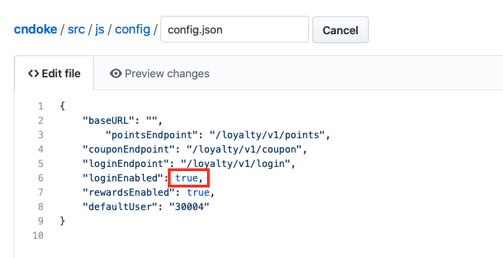
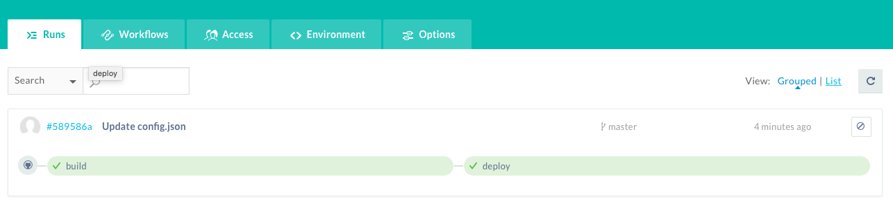
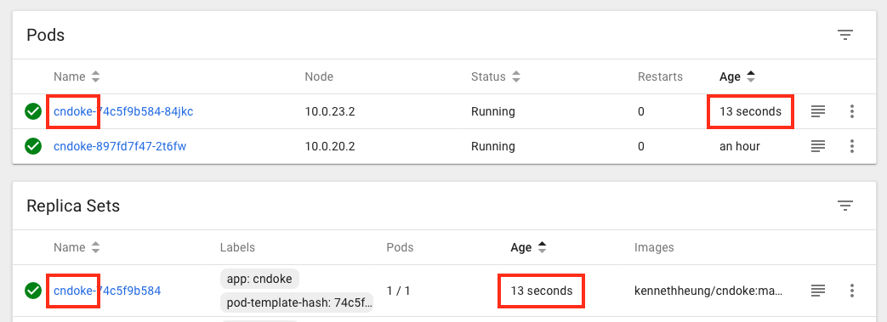

# Putting It All Together - Continuous Integration and Delivery

## Introduction

This is the fifth and last of several labs that are part of the **Oracle Public Cloud Container Native Development workshop**. This workshop will walk you through the process of moving an existing application into a containerized CI/CD pipeline and deploying it to a Kubernetes cluster in the Oracle Public Cloud.

You will take on 2 personas during the workshop. The **Lead Developer Persona** will be responsible for configuring the parts of the automated build and deploy process that involve details about the application itself. The **DevOps Engineer Persona** will configure the parts of the automation involving the Kubernetes infrastructure. To containerize and automate the building and deploying of this application you will make use of Wercker Pipelines for CI/CD, Docker Hub for a Docker container registry, and Oracle Container Engine for Kubernetes (OKE) to provision a Kubernetes cluster on Oracle Cloud Infrastructure.

During this lab we will demonstrate the complete end-to-end of our CI/CD lifecycle by monitoring your application's source code repository for commits and automatically trigger a build and deploy of your Docker image to a Kubernetes cluster.

## Objectives

**Validate Your Continuous Integration and Delivery Pipelines**

- Create database schema and populate with data
- Modify code and commit to GitHub
- Verify execution of Wercker workflow
- Verify deployment to Kubernetes
- Test the CafeSupremo application

## Create Database Schema and Populate with Data

### **STEP 1**: Initialise Your Database

- Due to the available time, we have automated the creation of the customer schema and population of data through an internal `initdb` API. By calling this API, it would create a customer schema with one record for user `user@email.com`.

- You can upload further data at a later date with SQL Developer or SQL Developer Web.

- From any browser, go to:

    `http://<external cluster-ip>/loyalty/initdb.html`

    Replace `<external cluster-ip>` with the IP for your application. This will execute the internal API and initialise your database.

  

- The API is meant to be discreet, hence the fields are not labled.

- Enter **admin** as the username and your password for the ATP instance your created previously. Click **Submit** to execute the API.

  **NOTE**: If you get a the following message then your database initialisation was successful.

    `{"message":"Table created with one record"}``

- You database is now set up with one user record for testing.

## Enable Login Service and Verify The Execution of Wercker Workflows

### **STEP 2**: Modify configuration file and commit to GitHub

- In a new browser tab, navigate to your forked cndoke repository on GitHub. If you've closed the tab, you can get back by going to GitHub, scrolling down until you see the your repositories box on the right side of the page, and clicking the **cndoke** link.

  

- Click the **Find file** button.

  

- Type `config` in the search bar, then click on `config.json` to open the file. This is the configuration file for defining the various endpoints, components and default user for the application. The exact detail for the various options is not important right now.

  

- Click the **pencil** button to begin editing the file.

  

- Line 6 defines whether our login service is enabled or not. It is currently set to `false`, meaning the login service has been disabled. This is the reason why we can't log into out application.

  

- Let's enable this by changing the flag from `false` to `true`.

  

- Scroll to the bottom of the page and click Commit changes.

  

- Take note of the Git commit hash displayed in the latest commit banner above the source code. We will use it to verify the version of code running in our Kubernetes cluster.

  

### **STEP 3**: Verify Execution of Wercker Workflow

- Switch to your Wercker browser tab. You will see that the workflow execution is already in progress, having been triggered by a webhook when you committed your code change. Take note of the Git commit hash that trigger the workflow. This should the same as the hash generated in the previous Git commit step.

  

- Click on the blue running **build** pipeline to follow the progress of each step. Note that you can click on each step to see the console output produced by that step. If any commands produce an error status code, Wercker will abort the workflow and notify you via email.

  

- Wait until the **deploy** pipeline to complete executing.

  

- In a new browser tab, navigate to the Kubernetes dashboard. Select your namespace `cndoke` and click on **Overview** in the left side navigation menu. You should see a new cndoke pod with a very small Age (a few seconds to a few minutes, depending on how much time has elapsed between the end of the Workflow execution and now). If you get to the dashboard very quickly after the Workflow finishes, you may see the old pod from the previous lab being terminated. The old pod will be removed from the UI within a minute of the new pods being started. Or you will see a new cndoke replica with a very small Age.

  

- This indicates that you have successfully redeployed your new build to the Kubernetes cluster.

### **STEP 4**: Validate The Application Functionality

- Still in the Kubernetes dashboard, click Services from the left side navigation menu. Then click the External endpoint URL for the **cndoke** service.

  

- The CafeSupremo site will load in a new tab. You will need to resize your browser so that the application home page would render in the correct format. Click on **Sign In** to log into the application.

  

- At the login dialog box enter `Oracle123` in the password field and click **Submit**.

  

- You should now be able to login and see your Rewards account page. The account will have several free coffee coupons for redemption. Click on the **Credit A Star** button to increment your reward points and watch the point counter increment. This is incrementing your record in the database.

  

- You can try redeeming a free coffee. Click on the **Free Coffee** label. This will bring up a QR code for redemption. To simulate the QR code being scanned, click on the **Redeem** button. Again, this will deduct your coupon from the database.

  

 We've gone from making a code change to having our new version built, and deployed to Kubernetes in just a couple of minutes!

## Congratulation!
### You have completed the Container Native Development with OKE Workshop.

**Return to home page [Home](README.md)**
