# Acquire an Oracle Cloud Trial

## Objectives

**Acquire an Oracle Cloud Trial Account**

- Sign up for an Oracle Cloud Trial Account
  - This is a free account
  - You will receive a $500 credit

## Required Artifacts

- The following labs require an Oracle Public Cloud account. You may use your own cloud account, or a cloud account that you obtained through a trial.

### **Step 1**: Acquire an Oracle Cloud Trial

- It is recommended to use **Google Chrome** for the sign up process.

- Please click on the following link to create your <a class="trial-link" href="https://myservices.us.oraclecloud.com/mycloud/signup?language=en&sourceType=:ex:tb:::RC_NAMK180826P00001:OKE_OCIR_HOL&SC=:ex:tb:::RC_NAMK180826P00001:OKE_OCIR_HOL&pcode=NAMK180826P00001" target="_trial">Free Account</a>, and complete all the required steps to get your free Oracle Cloud Trial Account. When you complete the registration process you'll receive a $500 credit that will enable you to complete the lab for free.  Additionally, you'll have 1000s of hours left over to continue to explore the Oracle Cloud._

- On the Sign Up page enter your email. Use the same email address you provided to Oracle when you signed up for this lab.

  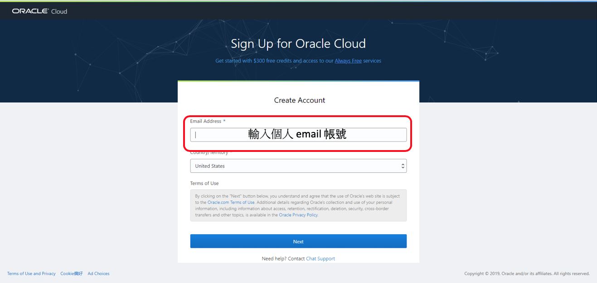

- Wait a moment for your email address to be verified. This will be followed by a pop up diaglog box.

  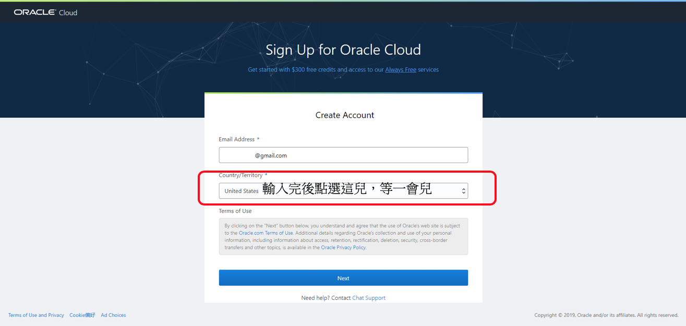

-  Click **OK** on the **Special Oracle Offer** pop up dialog box to accept the $500 trial credits for 30 days.

  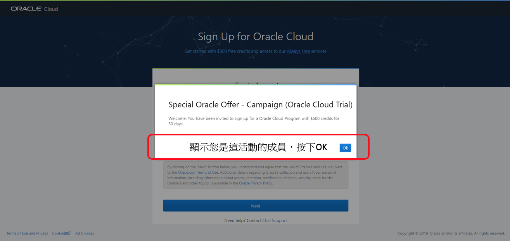

- The _Country/Territory_ field should be default to **United States**. Select **Taiwan** from the dropdown list.

  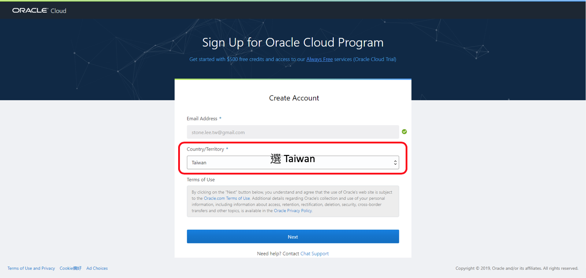

- Click **Next** to enter your account details.

  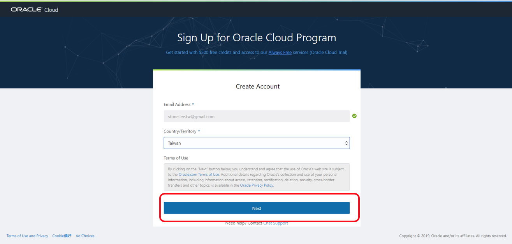

- Select **Personal Use** on the **Enter Account Details**

  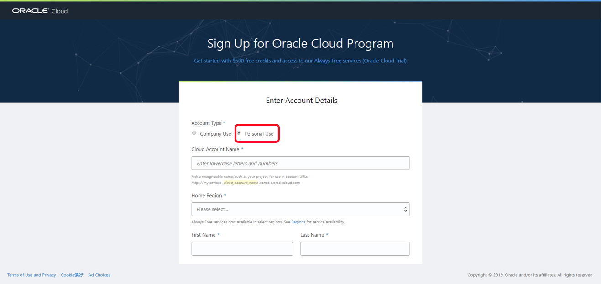

- Enter your **Cloud Account Name**

- Select _US East (Ashburn)_ in the **Home Region** dropdown list.

- And complete your name.

  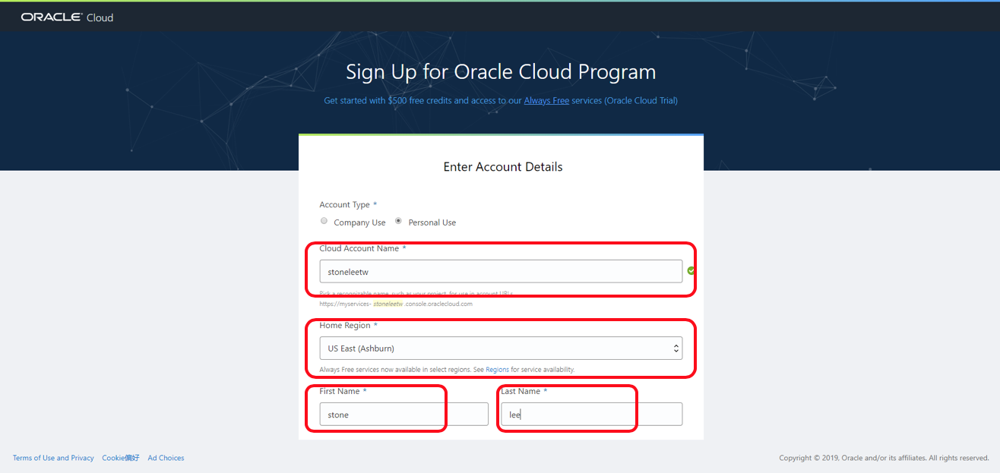

- Enter your **Address**, **City**, **Zip/Postal Code** and **Contact Phone Number**.

  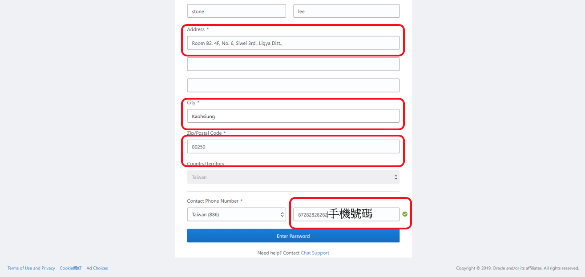

- Enter your **Password** and **Confirm Password**

  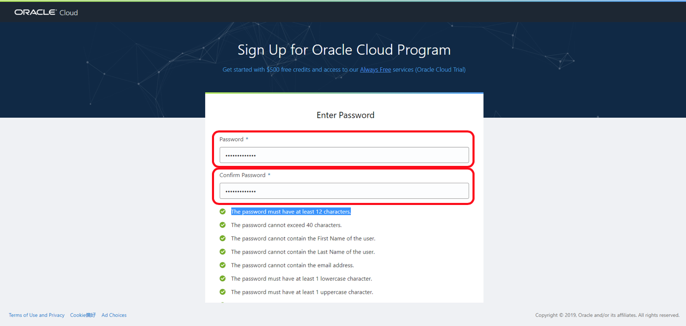

- Click **Review Terms and Conditions**

  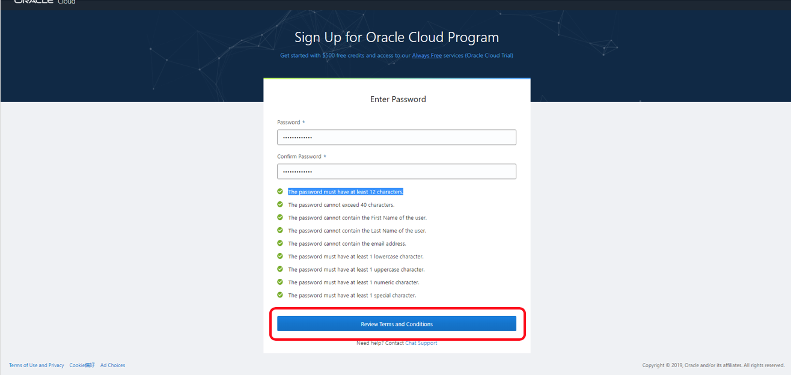

- Check the **Complete** check box and click on **Complete Sign-Up**

  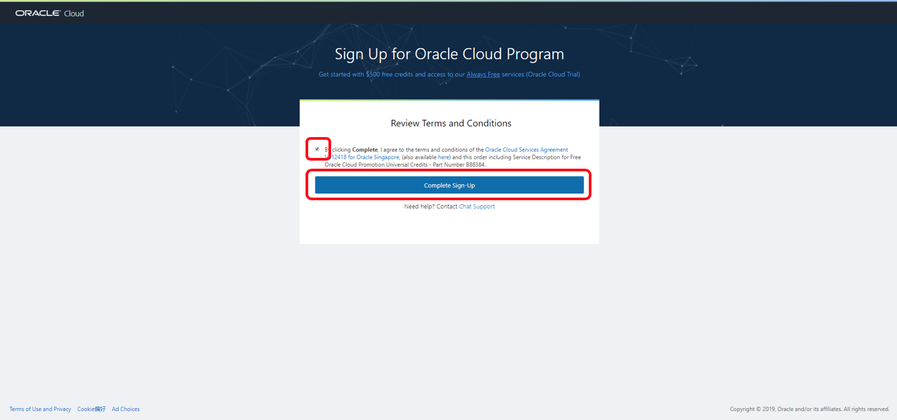

- Please wait while your account is being created.

  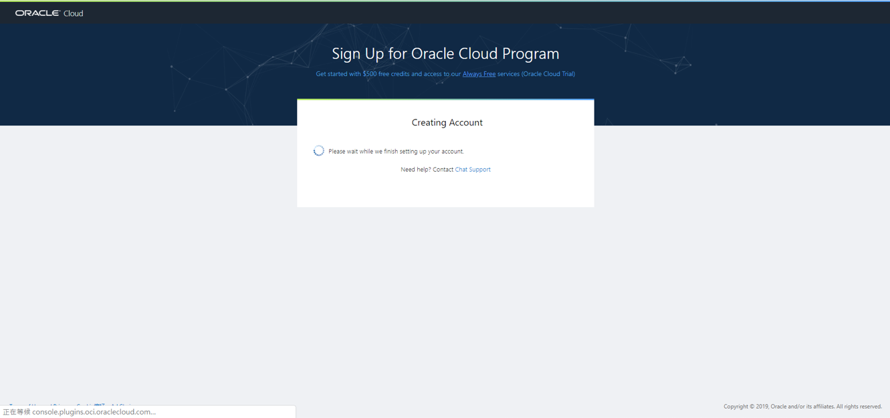

- Once completed you will be redirected to the Oracle Cloud Infrastructure (OCI) Console.

- Enter your _USER NAME_ and _PASSWORD_

- Please take note of your _cloud tenant_ name.

  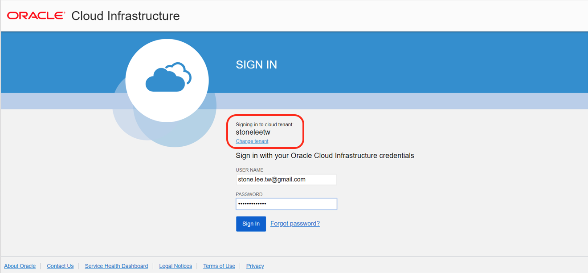

- Wait whilst you are being logged in.

  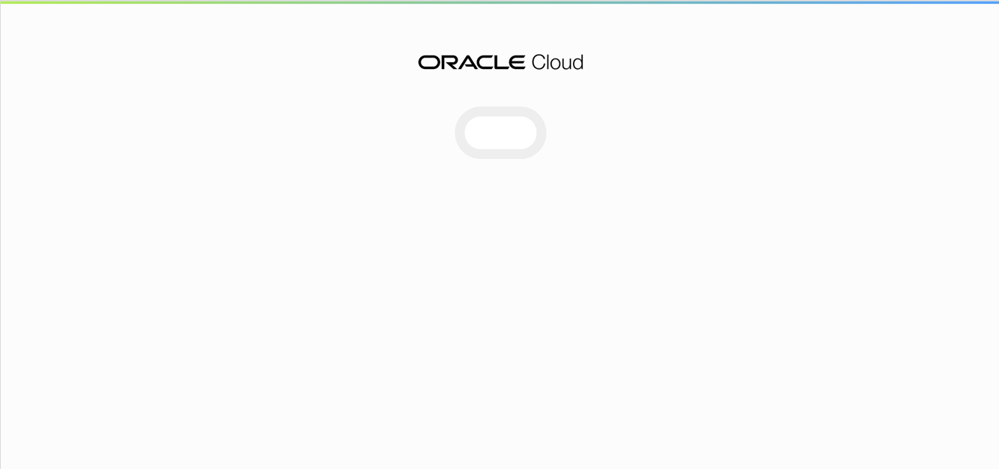

- Once you are logged in you will be directed to the home page for you OCI Console.

  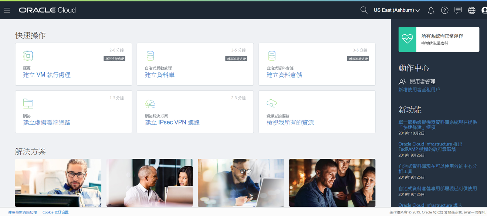

- You will need to change the language to English in order to follow the lab directions. Clicking on the global icon.

  

- Select _English_ from the dropdown list.

  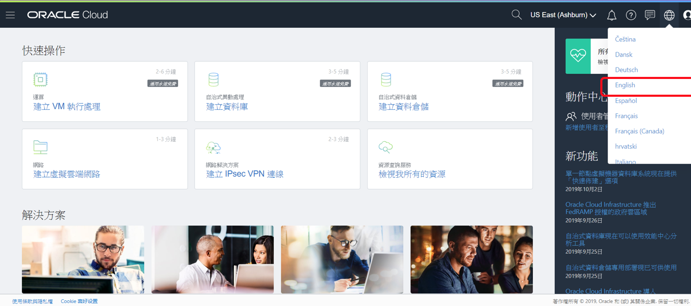

- Your OCI Console home page will be reloaded in English.

  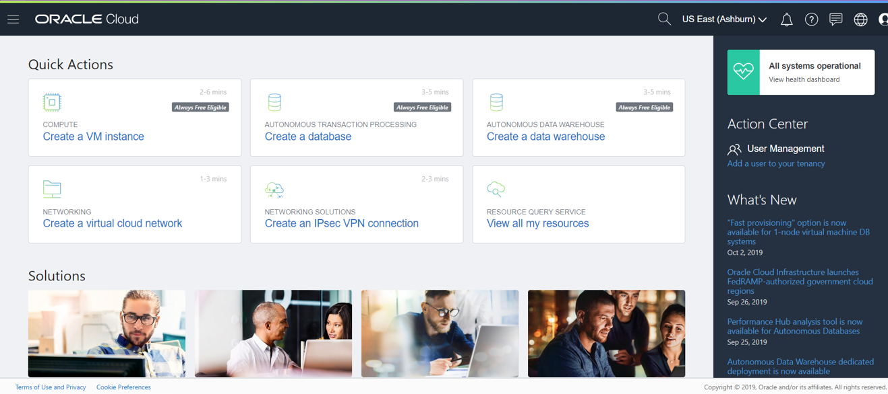

**You are now ready to move to the next lab: [Lab 200](LabGuide200.md)**
